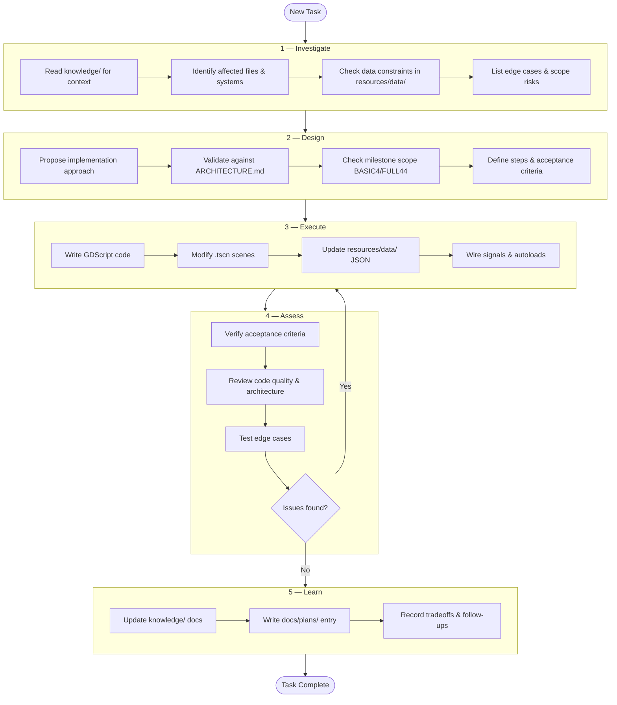

# IDEAL Workflow

The development process for Probabimals follows the **IDEAL** cycle: every task passes through five phases before it's considered complete.

## Process Diagram



## Phases

| # | Phase | Agent | Purpose | Output |
|---|-------|-------|---------|--------|
| 1 | **Investigate** | `my-agent-investigator` | Understand the task, gather context | Investigation report |
| 2 | **Design** | `my-agent-designer` | Plan the implementation | Step-by-step plan with acceptance criteria |
| 3 | **Execute** | `my-agent-executor` | Write code and modify scenes | Working code changes |
| 4 | **Assess** | `my-agent-assessor` | Review correctness and quality | Assessment verdict (APPROVED / NEEDS FIXES) |
| 5 | **Learn** | `my-agent-learner` | Document decisions, update knowledge | Updated docs, planning entry |

## Flow Rules

1. **Sequential execution** — phases run in order. Each phase requires the output of the previous one.
2. **Assessment loop** — if the Assessor finds issues, the task returns to the Executor. The loop repeats until the Assessor approves.
3. **Scope gate at Design** — the Designer must explicitly verify the task fits the current milestone (BASIC4 or FULL44). Out-of-scope work is deferred.
4. **Knowledge-first** — every task begins by reading `knowledge/` docs. This ensures agents work with current, accurate context.

## Team Mapping

| Phase | Primary Owner | AI Agent Role |
|-------|---------------|---------------|
| Investigate | Both | Reads codebase, surfaces affected files and risks |
| Design | Artem (design lead) | Proposes plan; Artem validates game design fit |
| Execute | Both (by domain) | Writes GDScript; Sofia reviews art/UI, Artem reviews logic |
| Assess | Sofia (QA lead) | Checks code + edge cases; Sofia playtests |
| Learn | Both | Updates docs; team reviews for accuracy |

## Project-Wide Rules

These apply to all agents in every phase:

1. **Always read `knowledge/` first** — especially `ARCHITECTURE.md` and the current milestone doc.
2. **Respect scope boundaries** — BASIC4 features only during BASIC4 work. FULL44 items are deferred and noted.
3. **Data-driven** — game parameters live in `resources/data/*.json`, not hardcoded in GDScript.
4. **Two autoloads only** — `GameManager` (state) and `DataManager` (data). No new singletons without team discussion.
5. **Signal-driven communication** — scenes talk via signals, not direct references.
6. **Three-screen architecture** — all gameplay fits into MainMenu, FleaMarket, and Combat.
7. **Item taxonomy** — three categories only: Dice, Faces, Modifiers.

## File Structure

```
docs/agents/
  workflow.md                   # this file
  my-agent-investigator.md      # phase 1: understand the task
  my-agent-designer.md          # phase 2: plan the solution
  my-agent-executor.md          # phase 3: write the code
  my-agent-assessor.md          # phase 4: review and test
  my-agent-learner.md           # phase 5: document and update
```
