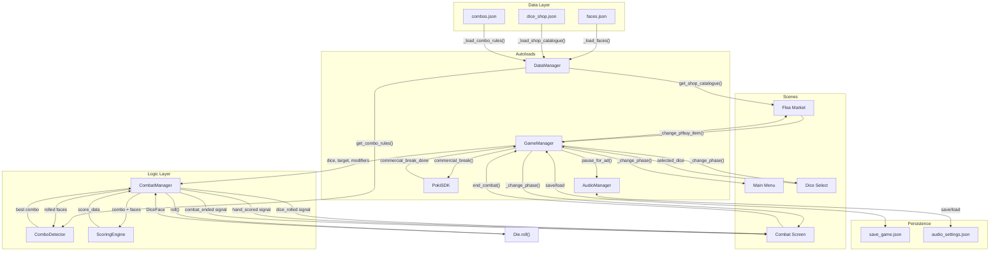
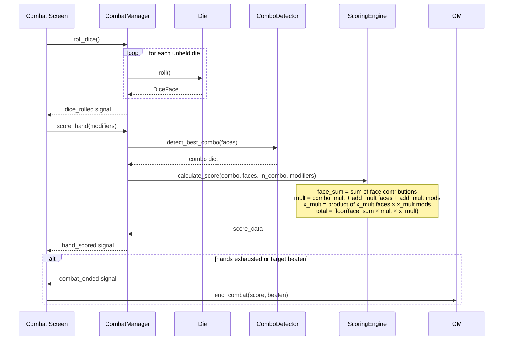
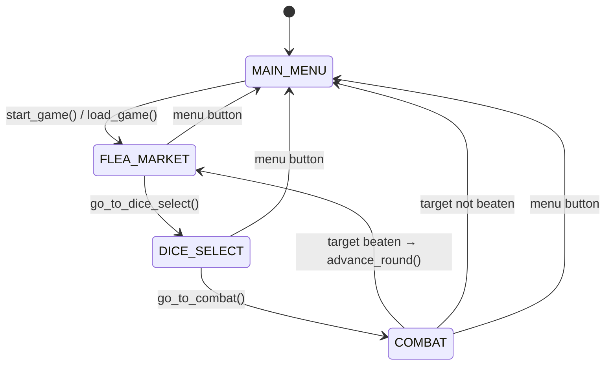

# Probabimals — Architecture

## 1. Core Architecture Patterns

Probabimals follows five well-known architectural patterns that work together to keep the codebase modular and maintainable.

### 1.1 Singleton (Autoload)

Godot's **Autoload** system registers global nodes that persist across scene changes. They act as application-wide services — any script can access them by name without passing references.

| Autoload | Responsibility |
|----------|---------------|
| `DataManager` | Loads JSON data files at startup; serves faces, shop catalogue, combo rules. Pure data accessor — no game logic. |
| `GameManager` | Owns game state: phase, coins, dice bag, modifiers, save/load. Drives scene transitions. |
| `AudioManager` | SFX pool, music crossfade, volume buses (Master / Music / SFX), settings persistence. |
| `PokiSDK` | Web platform integration: ad breaks, gameplay tracking. Stubs on non-web builds. |

**Why:** Singletons eliminate the need to pass shared state through constructor chains. In a Godot project where scenes are swapped entirely, autoloads are the only objects that survive across transitions.

### 1.2 Observer (Signals)

Godot's built-in **signal** system implements the Observer pattern. Emitters declare signals; listeners connect to them. Neither side knows about the other's internals.

Key signal flows:

| Emitter | Signal | Listeners |
|---------|--------|-----------|
| `GameManager` | `phase_changed` | Scene scripts (navigation) |
| `GameManager` | `coins_changed` | Shop UI (coin display) |
| `GameManager` | `score_changed` | Combat UI (score display) |
| `CombatManager` | `dice_rolled` | Combat screen (dice visuals) |
| `CombatManager` | `hand_scored` | Combat screen (score animation) |
| `CombatManager` | `combat_ended` | Combat screen (result overlay), `GameManager` (phase change) |
| `PokiSDK` | `commercial_break_done` | `GameManager` (resume after ad) |

**Why:** Signals decouple systems. The combat screen doesn't call `ScoringEngine` directly — it reacts to `hand_scored`. Adding a new listener (e.g., analytics) requires zero changes to the emitter.

### 1.3 Scene-Based State Machine

The game has four phases, each mapped to a dedicated scene:

```
MAIN_MENU  →  FLEA_MARKET  →  DICE_SELECT  →  COMBAT
                   ↑                              |
                   └──────── (win) ───────────────┘
                                    (lose) → MAIN_MENU
```

`GameManager` owns a `Phase` enum and a single `_change_phase()` method that:

1. Updates `current_phase`
2. Emits `phase_changed`
3. Saves game (unless returning to main menu)
4. Calls `get_tree().change_scene_to_file(...)` for the matching scene

**Why:** Each scene is self-contained — it builds its UI in `_ready()`, connects to autoload signals, and tears down cleanly when the tree swaps it out. No scene needs to know which scene came before it.

### 1.4 Data-Driven Design

All game content is defined in JSON files under `resources/data/`:

| File | Contents |
|------|----------|
| `faces.json` | Face definitions: id, value, face_type, effect_value, rarity, cost |
| `dice_shop.json` | Shop catalogue: item id, name, category (die/face/modifier), cost, params |
| `combos.json` | Combo rules: type, name, combo_mult, priority, pattern |

`DataManager` loads these at startup and exposes them through getter methods. No script hardcodes game parameters.

**Why:** Designers can tune balance by editing JSON without touching GDScript. Adding a new combo or shop item requires no code changes — only a new entry in the corresponding JSON file.

### 1.5 Separation of Concerns (MVC-like)

The codebase splits into three layers:

| Layer | Base class | Examples |
|-------|-----------|----------|
| **Data (Model)** | `RefCounted` | `Die`, `DiceFace`, `DiceBag` |
| **Logic (Controller)** | `RefCounted` / `Node` | `CombatManager`, `ComboDetector`, `ScoringEngine` |
| **Presentation (View)** | `Control` / `Node` | Scene scripts: `combat_screen.gd`, `flea_market_screen.gd` |

Data objects hold state and expose pure methods (`Die.roll()`, `DiceBag.draw(n)`). Logic objects orchestrate rules. UI scripts wire controls to signals and update visuals — they never compute scores or detect combos.

**Why:** `RefCounted` objects have no scene-tree dependency and can be unit-tested in isolation. UI changes don't break game logic; scoring changes don't break layouts.

---

## 2. Data Flow

### 2.1 Overall System Flow



### 2.2 Combat Scoring Pipeline



### 2.3 Phase Transition Flow



---

## 3. Code Examples (GDScript)

### 3.1 Singleton + State Machine — Phase Transitions

`GameManager` manages the current phase and drives scene changes. Every phase transition goes through a single method:

```gdscript
# scripts/autoload/game_manager.gd

enum Phase { MAIN_MENU, FLEA_MARKET, DICE_SELECT, COMBAT }

signal phase_changed(new_phase: Phase)

var current_phase: Phase = Phase.MAIN_MENU

func _change_phase(new_phase: Phase) -> void:
    var old_phase := current_phase
    current_phase = new_phase
    phase_changed.emit(new_phase)
    if new_phase != Phase.MAIN_MENU:
        save_game()

    if new_phase == Phase.MAIN_MENU and old_phase != Phase.MAIN_MENU:
        AudioManager.pause_for_ad()
        PokiSDK.commercial_break()
        await PokiSDK.commercial_break_done
        AudioManager.resume_after_ad()

    match new_phase:
        Phase.MAIN_MENU:
            get_tree().change_scene_to_file("res://scenes/main_menu/main_menu.tscn")
        Phase.FLEA_MARKET:
            get_tree().change_scene_to_file("res://scenes/flea_market/flea_market_screen.tscn")
            PokiSDK.gameplay_start()
        Phase.DICE_SELECT:
            get_tree().change_scene_to_file("res://scenes/dice_select/dice_select_screen.tscn")
        Phase.COMBAT:
            get_tree().change_scene_to_file("res://scenes/combat/combat_screen.tscn")
            PokiSDK.gameplay_start()
```

### 3.2 Data-Driven Loading

`DataManager` reads JSON at startup and converts raw dictionaries into typed objects:

```gdscript
# scripts/autoload/data_manager.gd

var _faces: Dictionary = {}

func _ready() -> void:
    _load_faces()
    _load_shop_catalogue()
    _load_combo_rules()

func _load_faces() -> void:
    var data = _load_json("res://resources/data/faces.json")
    if data is Array:
        for entry in data:
            var face := _dict_to_face(entry)
            _faces[face.id] = face

func _dict_to_face(d: Dictionary) -> DiceFace:
    return DiceFace.new(
        str(d.get("id", "")),
        int(d.get("value", 0)),
        DiceFace.type_from_string(str(d.get("face_type", "basic"))),
        float(d.get("effect_value", 0.0)),
        str(d.get("rarity", "common")),
        int(d.get("cost", 0)),
    )
```

### 3.3 Observer Pattern — Signal-Driven Combat

`CombatManager` emits signals after each action. The UI scene connects to them without the manager knowing anything about presentation:

```gdscript
# scripts/combat/combat_manager.gd

signal dice_rolled(values: Array[int])
signal hand_scored(combo: Dictionary, score_data: Dictionary)
signal combat_ended(final_score: int, target_beaten: bool)

func score_hand(modifiers: Array) -> Dictionary:
    var combo := get_current_combo()
    if combo.is_empty():
        return {}

    var in_combo: Array[bool] = combo.get("in_combo", [])
    var score_data := scoring_engine.calculate_score(combo, current_roll, in_combo, modifiers)
    running_score += score_data["total"]
    hands_remaining -= 1
    hands_changed.emit(hands_remaining)

    hand_scored.emit(combo, score_data)

    if hands_remaining <= 0 or running_score >= target_score:
        end_combat()

    return { "combo": combo, "score_data": score_data, "running_score": running_score }
```

### 3.4 Three-Layer Scoring Engine

Score calculation follows the formula `Total = floor(Face_Sum × Mult × X_Mult)`, with modifiers injected at each layer:

```gdscript
# scripts/scoring/scoring_engine.gd

func calculate_score(combo: Dictionary, rolled_faces: Array[DiceFace],
        in_combo: Array[bool], modifiers: Array) -> Dictionary:
    var combo_mult: float = combo.get("combo_mult", 1.0)

    # Layer 1: Face_Sum — base value from all rolled faces + bonus modifiers
    var face_sum := 0.0
    for face in rolled_faces:
        face_sum += face.get_face_sum_contribution()
    for mod in modifiers:
        if mod.get("effect", "") == "bonus" and _check_condition(mod, combo.get("type", "")):
            face_sum += mod.get("value", 0.0)

    # Layer 2: Mult — combo multiplier + additive mult from faces and modifiers
    var mult: float = combo_mult
    for i in range(rolled_faces.size()):
        mult += rolled_faces[i].get_add_mult()
    for mod in modifiers:
        if mod.get("effect", "") == "add_mult" and _check_condition(mod, combo.get("type", "")):
            mult += mod.get("value", 0.0)

    # Layer 3: X_Mult — multiplicative scaling from faces and modifiers
    var x_mult := 1.0
    for i in range(rolled_faces.size()):
        x_mult *= rolled_faces[i].get_x_mult()
    for mod in modifiers:
        if mod.get("effect", "") == "x_mult" and _check_condition(mod, combo.get("type", "")):
            x_mult *= mod.get("value", 1.0)

    var total := int(floor(face_sum * mult * x_mult))
    return { "face_sum": face_sum, "mult": mult, "x_mult": x_mult, "total": total }
```

---

## 4. Review Guidelines

### Architecture Rules

| Rule | Rationale |
|------|-----------|
| Data objects extend `RefCounted`; managers extend `Node` | `RefCounted` has no scene-tree overhead and is easy to test. Managers need lifecycle hooks (`_ready`, `_process`). |
| All global state lives in autoloads | Prevents hidden state in scene scripts that gets lost on scene change. |
| UI scripts never compute game logic | Keeps presentation swappable. UI connects to signals and updates visuals — nothing else. |
| Game parameters live in `resources/data/*.json` | Enables tuning without code changes. New content = new JSON entry. |
| Systems communicate via signals, not direct method calls | Decouples emitter from listener. Adding a new consumer requires zero changes to the producer. |
| Scene changes only through `GameManager._change_phase()` | Single point of control for save, ad breaks, and signal emission. |

### Naming Conventions

| Element | Convention | Example |
|---------|-----------|---------|
| Variables, functions | `snake_case` | `dice_bag`, `roll_dice()` |
| Classes | `PascalCase` | `CombatManager`, `ScoringEngine` |
| Constants | `UPPER_SNAKE_CASE` | `SAVE_PATH`, `SFX_POOL_SIZE` |
| Signals | `snake_case`, past tense verb | `dice_rolled`, `phase_changed` |
| Enums | `PascalCase` type, `UPPER_CASE` values | `Phase.FLEA_MARKET` |
| File names | `snake_case.gd` | `combat_manager.gd` |

### Code Review Checklist

- [ ] New system documents its signals (name, parameters, when emitted)
- [ ] No hardcoded game parameters — values come from JSON or constants
- [ ] `RefCounted` for data objects, `Node` only when scene-tree features are needed
- [ ] UI scripts contain no scoring, combo detection, or state mutation logic
- [ ] Phase transitions go through `GameManager._change_phase()`
- [ ] New autoload signals follow the `past_tense_verb` naming pattern
- [ ] Save/load updated if new persistent state is added
- [ ] No direct cross-references between scenes — use autoload signals
