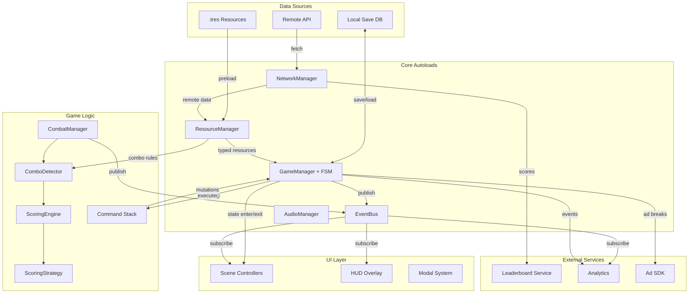
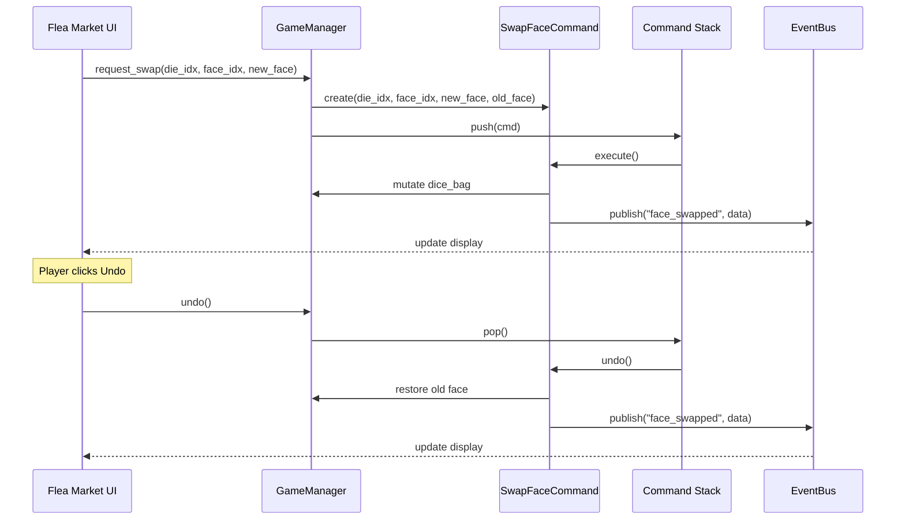
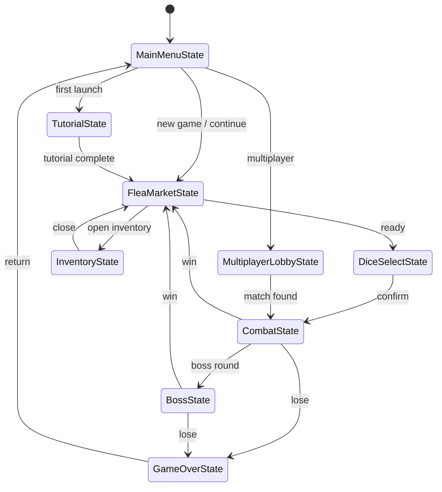

# Probabimals — Scaled Architecture (Big Project)

This document describes how the Probabimals architecture would evolve to support a larger team, richer content pipeline, networked features, and modding. It builds on top of the patterns in [architecture.md](architecture.md) and introduces additional patterns needed at scale.

---

## 1. Core Architecture Patterns

The five base patterns (Singleton, Observer, Scene-Based State Machine, Data-Driven Design, Separation of Concerns) remain, but are extended and formalized.

### 1.1 Event Bus (Mediator)

In the current project, signals live on the objects that emit them (`GameManager.phase_changed`, `CombatManager.dice_rolled`). As the system count grows, listeners need to know which exact object to connect to. An **Event Bus** centralizes all cross-system communication into a single autoload.

**What changes:** Scenes and systems publish and subscribe through `EventBus` instead of connecting directly to individual autoloads. The bus acts as a mediator — neither publisher nor subscriber knows about the other.

**Why at scale:** With 20+ systems, direct signal wiring becomes a dependency web. The event bus keeps the coupling graph flat: every system depends only on `EventBus`, not on every other system.

### 1.2 State Pattern (Formal FSM)

The current `Phase` enum and `match` statement work for 4 phases. A larger game might have 10+ states (tutorial, inventory, map, boss, cutscene, settings, multiplayer lobby). A **State Pattern** replaces the enum with state objects that encapsulate `enter()`, `exit()`, and `update()` logic.

**What changes:** Each phase becomes a `GameState` class with its own enter/exit hooks. `GameManager` holds a `current_state` reference and delegates lifecycle calls. Transitions are validated: not every state can reach every other state.

**Why at scale:** New phases are added by creating a new class — no edits to a growing `match` block. Enter/exit hooks handle resource loading, ad breaks, and analytics cleanly.

### 1.3 Command Pattern (Undo/Redo)

Dice customization (face swaps, modifier purchases) currently mutates state directly. The **Command Pattern** wraps each mutation in an object with `execute()` and `undo()` methods, enabling undo/redo and action replay.

**What changes:** Actions like `SwapFaceCommand`, `BuyItemCommand`, `SellItemCommand` are created, pushed onto a history stack, and executed. `GameManager` exposes `undo()` and `redo()`.

**Why at scale:** Players want to experiment with builds without fear. Undo/redo makes the flea market a design sandbox. Command objects also enable replay logging and server-side validation for multiplayer.

### 1.4 Strategy Pattern (Pluggable Scoring)

The current `ScoringEngine` hard-codes the three-layer formula. A **Strategy Pattern** lets different game modes plug in alternative scoring algorithms without modifying the engine.

**What changes:** `ScoringEngine` holds a `ScoringStrategy` reference. Each strategy implements `calculate(combo, faces, modifiers) -> ScoreResult`. Strategies like `ClassicScoring`, `SpeedRunScoring`, `ChallengeScoring` can be swapped at runtime.

**Why at scale:** New game modes (daily challenges, tournaments, cooperative scoring) need different rules. The strategy pattern avoids a growing forest of `if mode == ...` branches inside the engine.

### 1.5 Resource-Based Configuration

Raw JSON works for small datasets but lacks type safety and editor integration. Godot's **Custom Resources** (`.tres` files) provide typed, serializable data objects editable in the Inspector.

**What changes:** `FaceResource`, `DieResource`, `ComboRuleResource` classes extend `Resource`. Data files become `.tres` instead of `.json`. The editor validates types, shows dropdowns for enums, and previews assets.

**Why at scale:** Designers use the Godot editor directly instead of hand-editing JSON. Type errors are caught at save time, not at runtime. Resources also support inheritance and sub-resources.

### 1.6 Entity-Component System (ECS-like)

If the game expands beyond dice (e.g., creatures, items with passive effects, board tiles), a full object hierarchy becomes unwieldy. An **ECS-like approach** decomposes entities into data components processed by systems.

**What changes:** A `Die` is no longer a monolithic class but an entity with `FaceComponent`, `ColorComponent`, `ModifierComponent`, etc. Systems like `RollSystem`, `ScoringSystem`, `RenderSystem` iterate over entities with matching components.

**Why at scale:** New entity types are compositions of existing components — no deep inheritance trees. Systems process data in bulk, enabling optimization.

---

## 2. Data Flow

### 2.1 Scaled System Overview



### 2.2 Command Execution Flow



### 2.3 State Machine Transitions



---

## 3. Code Examples (GDScript / Pseudocode)

### 3.1 Event Bus Singleton

```gdscript
# scripts/autoload/event_bus.gd
extends Node

# Typed signal declarations for cross-system events.
# Any system can emit; any system can connect.

signal phase_entered(phase_name: String)
signal phase_exited(phase_name: String)
signal coins_changed(new_amount: int)
signal item_purchased(item_id: String)
signal face_swapped(die_index: int, face_index: int)
signal dice_rolled(values: Array[int])
signal hand_scored(combo_name: String, total: int)
signal combat_ended(final_score: int, won: bool)
signal round_advanced(round_number: int)
signal save_requested()
signal analytics_event(event_name: String, data: Dictionary)
```

Usage from any system:

```gdscript
# Emitting (in CombatManager):
EventBus.hand_scored.emit(combo.name, score_data.total)

# Subscribing (in CombatScreen):
func _ready() -> void:
    EventBus.hand_scored.connect(_on_hand_scored)

func _on_hand_scored(combo_name: String, total: int) -> void:
    score_label.text = str(total)
    _play_combo_animation(combo_name)
```

### 3.2 Command Pattern for Face Swaps

```gdscript
# scripts/commands/command.gd
class_name Command
extends RefCounted

func execute() -> void:
    pass

func undo() -> void:
    pass


# scripts/commands/swap_face_command.gd
class_name SwapFaceCommand
extends Command

var _die: Die
var _face_index: int
var _new_face: DiceFace
var _old_face: DiceFace

func _init(die: Die, face_index: int, new_face: DiceFace) -> void:
    _die = die
    _face_index = face_index
    _new_face = new_face
    _old_face = die.faces[face_index]

func execute() -> void:
    _die.swap_face(_face_index, _new_face)
    EventBus.face_swapped.emit(_die, _face_index)

func undo() -> void:
    _die.swap_face(_face_index, _old_face)
    EventBus.face_swapped.emit(_die, _face_index)


# scripts/autoload/command_stack.gd — autoload
extends Node

var _history: Array[Command] = []
var _redo_stack: Array[Command] = []

func execute(cmd: Command) -> void:
    cmd.execute()
    _history.append(cmd)
    _redo_stack.clear()

func undo() -> void:
    if _history.is_empty():
        return
    var cmd := _history.pop_back()
    cmd.undo()
    _redo_stack.append(cmd)

func redo() -> void:
    if _redo_stack.is_empty():
        return
    var cmd := _redo_stack.pop_back()
    cmd.execute()
    _history.append(cmd)
```

### 3.3 State Machine with Enter / Exit Hooks

```gdscript
# scripts/state_machine/game_state.gd
class_name GameState
extends RefCounted

var state_machine: GameStateMachine

func enter(_params: Dictionary = {}) -> void:
    pass

func exit() -> void:
    pass

func update(_delta: float) -> void:
    pass


# scripts/state_machine/flea_market_state.gd
class_name FleaMarketState
extends GameState

func enter(params: Dictionary = {}) -> void:
    EventBus.phase_entered.emit("flea_market")
    PokiSDK.gameplay_start()
    get_tree().change_scene_to_file("res://scenes/flea_market/flea_market_screen.tscn")

func exit() -> void:
    EventBus.phase_exited.emit("flea_market")
    GameManager.save_game()


# scripts/state_machine/game_state_machine.gd
class_name GameStateMachine
extends RefCounted

var _states: Dictionary = {}
var _current_state: GameState

func register(name: String, state: GameState) -> void:
    state.state_machine = self
    _states[name] = state

func transition_to(name: String, params: Dictionary = {}) -> void:
    if _current_state:
        _current_state.exit()
    _current_state = _states[name]
    _current_state.enter(params)

func update(delta: float) -> void:
    if _current_state:
        _current_state.update(delta)
```

### 3.4 Strategy-Based Scoring

```gdscript
# scripts/scoring/scoring_strategy.gd
class_name ScoringStrategy
extends RefCounted

func calculate(combo: Dictionary, faces: Array[DiceFace],
        in_combo: Array[bool], modifiers: Array) -> Dictionary:
    return {}


# scripts/scoring/classic_scoring.gd
class_name ClassicScoring
extends ScoringStrategy

func calculate(combo: Dictionary, faces: Array[DiceFace],
        in_combo: Array[bool], modifiers: Array) -> Dictionary:
    # Standard three-layer formula: floor(face_sum × mult × x_mult)
    var face_sum := 0.0
    for face in faces:
        face_sum += face.get_face_sum_contribution()

    var mult: float = combo.get("combo_mult", 1.0)
    for face in faces:
        mult += face.get_add_mult()

    var x_mult := 1.0
    for face in faces:
        x_mult *= face.get_x_mult()

    return {
        "face_sum": face_sum, "mult": mult,
        "x_mult": x_mult, "total": int(floor(face_sum * mult * x_mult)),
    }


# scripts/scoring/speed_run_scoring.gd
class_name SpeedRunScoring
extends ScoringStrategy

func calculate(combo: Dictionary, faces: Array[DiceFace],
        in_combo: Array[bool], modifiers: Array) -> Dictionary:
    # Speed mode: score = base × time_bonus. No mult layers.
    var base := 0.0
    for face in faces:
        base += face.value
    var time_bonus: float = combo.get("time_bonus", 1.0)
    return {
        "face_sum": base, "mult": 1.0,
        "x_mult": time_bonus, "total": int(base * time_bonus),
    }


# Usage in ScoringEngine:
# var strategy: ScoringStrategy = ClassicScoring.new()
# var result := strategy.calculate(combo, faces, in_combo, modifiers)
```

---

## 4. Review Guidelines (Scaled Team)

### Architecture Rules

| Rule | Rationale |
|------|-----------|
| Cross-system communication goes through `EventBus` only | Prevents hidden coupling. Grep for signal names to trace any flow. |
| Phase logic lives in `GameState` subclasses, not in `GameManager` match blocks | Open/closed principle — add phases without editing existing code. |
| Mutations to player state go through `Command` objects | Enables undo/redo, replay logging, and server validation. |
| Scoring algorithms implement `ScoringStrategy` | New game modes don't touch the core engine. |
| Game content uses Godot `Resource` (`.tres`), not raw JSON | Type safety, editor integration, asset dependencies tracked by the engine. |
| No singleton access from data objects (`RefCounted`) | Data objects must remain pure — pass dependencies as parameters. |

### Process Rules

| Rule | Rationale |
|------|-----------|
| All changes go through pull requests with at least one reviewer | Catches design violations before merge. |
| Unit tests required for scoring, combo detection, and command execute/undo | These are the most breakable and most critical systems. |
| Scripts must not exceed 300 lines | Forces decomposition. If a script grows past 300, split it. |
| Public methods and signals require doc comments | A growing team cannot rely on tribal knowledge. |
| Performance budget: combat frame must stay under 16ms | Profiling catches regressions before players do. |
| Prefer dependency injection over direct autoload access in logic classes | Makes testing possible without the full engine running. |

### Naming Conventions

Same as the base project, with additions:

| Element | Convention | Example |
|---------|-----------|---------|
| State classes | `*State` suffix | `FleaMarketState`, `CombatState` |
| Command classes | `*Command` suffix | `SwapFaceCommand`, `BuyItemCommand` |
| Strategy classes | `*Scoring` suffix | `ClassicScoring`, `SpeedRunScoring` |
| Resource classes | `*Resource` suffix | `FaceResource`, `ComboRuleResource` |
| Event bus signals | domain-scoped `snake_case` | `combat_ended`, `item_purchased` |
| Test files | `test_` prefix | `test_scoring_engine.gd` |

### Code Review Checklist

- [ ] New cross-system communication uses `EventBus`, not direct signal connections
- [ ] State transitions use `GameStateMachine.transition_to()`, not raw scene changes
- [ ] Player-state mutations are wrapped in `Command` objects
- [ ] `RefCounted` classes do not reference autoloads — dependencies are injected
- [ ] New `.tres` resources have doc comments on exported properties
- [ ] Unit tests cover the happy path and at least one edge case
- [ ] Script line count stays under 300
- [ ] No hardcoded game parameters — values come from resources or constants
- [ ] PR description explains *why*, not just *what*
