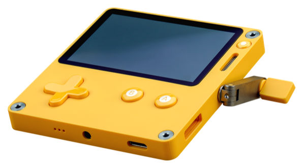
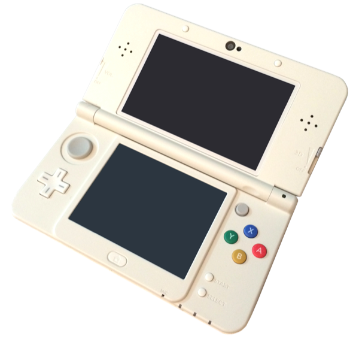

# Console Porting Design — Probabimals

## 1. Playdate Port

### Hardware Overview

| Spec | Value |
|------|-------|
| Display | 400×240, 1-bit (black & white), no backlight |
| Input | D-pad, A button, B button, crank |
| Audio | Mono speaker, headphone jack |
| CPU | 180 MHz Cortex-M7 |
| RAM | 16 MB |
| Storage | 4 GB flash |
| SDK | Lua or C |

### Display Adaptation

The original game targets 1280×720 with a colorful Balatro-inspired neon-on-felt aesthetic. The Playdate's 1-bit 400×240 screen demands a complete visual rethink.

**Dice rendering:** Replace colored sprite sheets with high-contrast black-and-white pip designs. Each die face should be drawn large enough to read clearly on the small screen — roughly 40×40 px per die, allowing all 5 combat dice to fit in a row with spacing. Use thick outlines and dithering patterns sparingly (e.g. halftone fill to distinguish held dice from free dice).

**Screen layout:** The original game displays dice, score, reroll counters, combo labels, and modifier list simultaneously. On Playdate, use a single-screen focus approach:

- **Combat:** Dice row centered, current score and blind target at the top, reroll count at the bottom. Combo name appears as a brief overlay after scoring.
- **Flea Market:** Scrollable item list with one item card visible at a time (name, cost, short description). The dice bag is a separate sub-screen.
- **Face Swap:** Full-screen view of a single die showing all 6 faces. Highlight the face being replaced and the incoming face side-by-side.

**Modifiers:** Because the original shows modifiers as a visible sidebar list, the Playdate port should move them to a dedicated "check modifiers" screen accessible via B-button, showing a scrollable text list with dither-pattern icons.

### Input Mapping

| Action | Original (Mouse) | Playdate |
|--------|-------------------|----------|
| Select die to hold/release | Click die | D-pad to highlight die, A to toggle hold |
| Reroll | Click "Reroll" button | Crank turn (quarter-turn triggers reroll) |
| Navigate shop items | Click item card | D-pad left/right to browse, A to buy |
| Confirm purchase | Click "Buy" button | A on selected item |
| View dice bag | Click bag icon | B to open bag overlay |
| Swap face | Drag face onto die | D-pad to select face slot, A to confirm swap |
| Back / Cancel | Click back button | B button |

The **crank** is the Playdate's signature input. Use it as the primary reroll mechanism: the player physically cranks to roll the dice, with each quarter-turn triggering one reroll. This replaces a button press with a tactile, satisfying action that reinforces the dice-rolling fantasy. The crank can also scroll through long modifier lists or shop catalogues.

### Audio & Engine

**Audio:** Mono speaker — SFX-first approach (dice_roll, combo_detect, purchase, round_win in ADPCM). Short looping chiptune tracks for market/combat. No crossfade — hard-cut on scene transitions.

**Engine:** Godot does not export to Playdate — **full rewrite in Lua SDK**. The game is turn-based and UI-driven, so Lua's sprite/input/audio APIs cover all needs. JSON data files (faces, dice_shop, combos) port directly via `playdate.json`. Scene FSM replicated as a Lua state machine. Saves via `playdate.datastore`.

### Scope Adjustments

| Feature | Keep / Cut / Change |
|---------|---------------------|
| Core loop (market → customize → combat) | **Keep** — this is the game |
| 5 dice, hold/reroll, combos | **Keep** |
| Modifiers | **Keep** — reduce to 8–10 most impactful to simplify UI |
| Colored dice / flush combos | **Cut** — color is meaningless on 1-bit; replace flush with "Crank Bonus" (all different values) |
| Animations (score burst, dice roll) | **Change** — frame-based sprites (2–4 frames); dice roll uses screen shake |
| Tutorial | **Change** — single "How to Play" screen from menu |
| Poki SDK / web integration | **Cut** |
| Save system | **Keep** — `playdate.datastore` for JSON save/load |

---

## 2. Nintendo 3DS Port

### Hardware Overview

| Spec | Value |
|------|-------|
| Top screen | 400×240 (800×240 stereoscopic 3D mode) |
| Bottom screen | 320×240, resistive touchscreen |
| Input | D-pad, Circle Pad, A/B/X/Y, L/R shoulders, touchscreen |
| Audio | Stereo speakers |
| CPU | Dual-core ARM11 (268 MHz) + ARM9 |
| RAM | 128 MB (64 MB app-accessible on New 3DS) |
| GPU | DMP PICA200 |
| SDK | C/C++ via devkitPro (libctru + citro2d/citro3d) |

### Dual-Screen Layout

The 3DS's two screens are a natural fit for Probabimals, which already separates "information" (scores, modifiers, inventory) from "action" (dice rolling, shopping).

**Combat:**

- **Top screen (400×240):** The dice tray. Show all 5 dice prominently (60×60 px each with spacing), the current combo name, and the score animation. Use the stereoscopic 3D layer to pop dice forward when held and push them back when free — subtle depth cue that replaces the original's color-based hold indicator.
- **Bottom screen (320×240, touch):** Control panel. Show the blind target, running score, reroll counter, and hand counter as a dashboard. Tap individual dice on the top screen's mirrored layout to hold/release them. "Reroll" and "End Hand" buttons are large touch targets at the bottom.

**Flea Market:**

- **Top screen:** Preview panel. Show the currently highlighted item's full artwork, name, rarity, and detailed description.
- **Bottom screen:** Browsable item grid (3 columns × scrollable rows). Tap to select, tap "Buy" to purchase. Coin balance displayed in the corner. Tabs at the top for Dice / Faces / Modifiers.

**Face Swap:**

- **Top screen:** The selected die rendered large with all 6 faces visible in a ring layout.
- **Bottom screen:** The player's owned faces in a scrollable list. Tap a face in inventory, then tap the slot on the top screen to swap.

**Menus:**

- **Top screen:** Game logo, background art.
- **Bottom screen:** Menu buttons (Start, Continue, Options). Touch-driven navigation.

### Input Mapping

The 3DS offers both physical buttons and a touchscreen, allowing two parallel input paths:

| Action | Touch path | Button path |
|--------|------------|-------------|
| Hold/release die | Tap die on bottom screen | D-pad to highlight, A to toggle |
| Reroll | Tap "Reroll" button | R shoulder |
| End hand | Tap "End Hand" button | L shoulder |
| Browse shop | Tap items in grid | D-pad to navigate, A to select |
| Buy item | Tap "Buy" button | A on highlighted item |
| Swap face | Tap face → tap slot | D-pad + A |
| Back | Tap back arrow | B button |
| View modifiers | Tap modifiers tab | Y button |

Supporting both paths makes the game accessible regardless of player preference. The touchscreen is primary for shopping (grid browsing is faster with touch), while buttons may feel better in combat (holding the console with both hands during tense rerolls).

### Visual Adaptation

The 3DS is capable of full-color 2D rendering, so the original art style can be **largely preserved**. Downscale 1280×720 sprite sheets to 400×240-appropriate sizes — no style change needed. Keep the felt background texture as a tiled version; bottom screen gets a cleaner UI background for touch readability.

**Stereoscopic 3D (optional):** Render dice and combo popups on a foreground layer, felt on a mid layer, UI chrome on the rear layer — pure parallax on 2D sprites. Players who disable 3D lose nothing. Target 30 FPS.

### Audio & Engine

**Audio:** Stereo speakers — the original audio design ports with minimal changes. Convert SFX to BCWAV, music to BCSTM. Crossfade reimplemented via ndsp channels (24 DSP channels available). Stereo panning adds spatial cues for dice rolling.

**Engine:** Godot does not export to 3DS — **full rewrite in C/C++** using devkitPro (libctru + citro2d for rendering, ndsp for audio). JSON data files loaded via cJSON. Dual-screen rendering: each game state implements `draw_top()` and `draw_bottom()` for separate framebuffers. Saves via 3DS extdata archive.

### Scope Adjustments

| Feature | Keep / Cut / Change |
|---------|---------------------|
| Core loop (market → customize → combat) | **Keep** |
| 5 dice, hold/reroll, combos | **Keep** |
| Modifiers | **Keep** — full set; bottom screen has room for a scrollable list |
| Colored dice / flush combos | **Keep** — the 3DS displays color |
| Animations | **Keep** — GPU handles 2D animation at 30 FPS comfortably |
| Full audio (SFX + music + crossfade) | **Keep** |
| Tutorial | **Keep** — bottom-screen touch tutorial overlays work well |
| Poki SDK / web integration | **Cut** |
| Save system | **Keep** — map to 3DS save archive |
| Stereoscopic 3D | **Add** — low-effort parallax depth for dice and UI layers |
| StreetPass | **Add** — exchange high scores or dice builds with other players |
