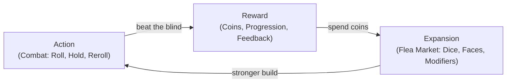
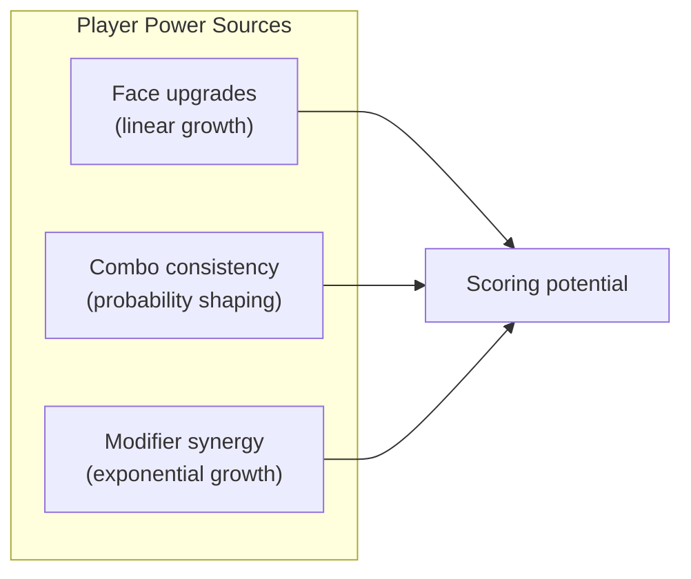

# Game Concept Preparation

## Overview

**Probabimals** — round-based dice strategy game inspired by Yahtzee and Balatro. Players collect and customize dice, then roll them in combat to score points through combinations.

**Core Loop:** buy dice and parts at the flea market → customize dice faces → roll combos in combat to beat the target score.

**Design Pillars:**

1. **Meaningful randomness** — outcomes are probabilistic, but the player's choices in dice selection and face customization heavily influence the odds.
2. **Dice crafting** — depth comes from discovering synergies between dice, faces, and modifiers to build powerful scoring engines.
3. **Round progression** — each round offers new dice and parts alongside escalating score targets, encouraging adaptation.

### References

**Gameplay:**

| Game | What we take from it |
|------|----------------------|
| **Balatro** | Escalating blinds, joker/modifier system that defines builds, "chips x mult" scoring feel |
| **Yahtzee** | Roll + keep/reroll mechanic, combo taxonomy (pairs, straights, full house, etc.) |
| **Dice Forge** | Swappable die faces as the core customization mechanic |
| **Slice & Dice** | Digital dice roguelike — each die = a unit with custom faces, tactical roll phase |
| **King of Tokyo** | Yahtzee-style rolling in a combat wrapper, push-your-luck tension |

**Visual / UI:**

| Reference | What to look at |
|-----------|-----------------|
| **Balatro** | Card layout, shop UI, scoring animation (chips + mult flying in), neon-on-felt aesthetic |
| **Dicey Dungeons** | Dice as prominent UI elements, clear face readability, colorful character-driven style |
| **Slice & Dice** | Compact dice tray, face icons, minimal but readable combat UI |
| **Slay the Spire** | Shop/reward screen layout, map progression, modifier/relic display |
| **Ganz Schon Clever** | Dice selection UI, color-coding, combo chain visualization |

---

## 1. Team

| Name             | Roles                                                      |
|------------------|------------------------------------------------------------|
| Artem Abaturov   | Game design, Programming, Project Management               |
| Sofia Petrenko   | Art & Visual Design, Programming, Audio, QA & Playtesting  |

### Responsibility Areas

- **Game Design** — core mechanics (dice systems, combo scoring, synergies), dice/face/modifier design, balance and tuning, round progression.
- **Programming** — game logic (dice rolling, rerolls, combo resolution, score calculation), UI implementation, animations/VFX, data architecture, audio integration.
- **Art & Visual Design** — UI/UX layouts and wireframes, sprite art (dice, faces, modifiers, ui), visual effects, fonts and color palette.
- **Audio** — SFX (dice rolls, clicks, jingles), ambient sounds, music.
- **Project Management** — task tracking, milestone planning (BASIC4 → FULL44), playtesting coordination.
- **QA & Playtesting** — bug reporting, balance testing, UX testing.

---

## 2. Tech

### Engine

**Godot 4.x** with **GDScript**

**Why Godot:**

- Free and open-source — no licensing fees or revenue share.
- Best-in-class 2D engine — ideal for a UI-heavy game with dice displays, drag-and-drop customization, and card-like shop items.
- Built-in visual editor — scenes, animations, particles, and UI layouts are created visually.
- Signal system — native event-driven architecture, perfect for "dice rolled → evaluate combos → play animation" flows.
- One-click export — builds for Windows, macOS, Linux (and optionally web/mobile).
- Lightweight — ~40 MB engine, fast iteration cycle.

**Why GDScript:**

- Python-like syntax — low barrier to entry.
- First-class Godot integration — autocomplete, debugger, profiler out of the box.
- Sufficient for the project's complexity.

### Target Platform

- **Primary:** Desktop (Windows, macOS, Linux)
- **Stretch:** Web export (HTML5)

### Project Structure

```
project.godot

scenes/
  main_menu/
  flea_market/
  combat/

scripts/
  autoload/           # GameManager, DataManager
  dice/               # die.gd, dice_bag.gd
  scoring/            # scoring_engine.gd, combo_detector.gd
  combat/             # combat_manager.gd

assets/
  art/                # dice, faces, modifiers, ui
  audio/              # sfx, music
  fonts/

resources/
  data/               # faces.json, dice_shop.json, combos.json
  themes/             # default_theme.tres
```

### Version Control

- Git with `.gitignore` tailored for Godot (ignore `.godot/` cache directory).
- Knowledge docs in `knowledge/`, consolidated design in `docs/`.

---

## 3. Game Idea

### Core Loop

Each round consists of two phases:

**Phase 1 — Preparation ("The Flea Market"):**
- The player visits a flea market to buy dice, replacement faces, and modifiers.
- **Dice** go into the player's bag. Each die has 6 faces (default: numbers 1–6).
- **Faces** can be swapped onto existing dice to change their odds (Dice Forge style).
- **Modifiers** are joker-like items that transform scoring rules globally.

**Phase 2 — Combat ("The Roll"):**
- The player rolls 5 dice from their bag.
- After seeing the result, the player may **keep** some dice and **reroll** the rest (up to 2 rerolls).
- The final result is scored based on **combinations** (pairs, straights, full house, etc.).
- Modifiers apply on top, multiplying or transforming the score.
- The goal is to beat the round's **target score** (blind).

### Key Concepts

- **Die** — a six-sided die from the player's bag. Base dice are colorless with faces 1–6. Colored dice are rarer and unlock color-based combos.
- **Face** — a single side of a die. Faces can be swapped at the flea market to change a die's number distribution (e.g. replace a 1-face with a second 6-face).
- **Modifier** — a joker-like item with a global effect on scoring (e.g. "all Full Houses score double", "pairs count as triples"). The primary source of build-defining power.
- **Combo** — a scoring pattern in the rolled dice. Based on Yahtzee: Pair, Two Pair, Three of a Kind, Full House, Small Straight, Large Straight, Four of a Kind, Yahtzee (five of a kind). Colored dice add Flush (5 dice of the same color).
- **Reroll** — the player's tactical tool. After rolling, keep favorable dice and reroll the rest. Limited to 2 rerolls per hand by default.
- **Blind** — the target score the player must beat to advance. Escalates each round.

### Building Blueprint

The player's "build" consists of three layers that work together:

```
┌─────────────────────────────────────────────┐
│                 MODIFIERS                    │
│  Global scoring rules that reshape combos   │
│  (e.g. "Full Houses x2", "pairs → triples") │
├─────────────────────────────────────────────┤
│              DICE BAG (5+ dice)             │
│  ┌───────┐ ┌───────┐ ┌───────┐ ┌───────┐   │
│  │ Die 1 │ │ Die 2 │ │ Die 3 │ │ Die 4 │…  │
│  │[faces]│ │[faces]│ │[faces]│ │[faces]│   │
│  └───────┘ └───────┘ └───────┘ └───────┘   │
│  Each die: 6 customizable faces             │
├─────────────────────────────────────────────┤
│               COMBAT RESOURCES              │
│  Hands per round · Rerolls per hand         │
└─────────────────────────────────────────────┘
```

**What the player needs to build a functional setup:**

| Component | Minimum (BASIC4) | What it does |
|-----------|-------------------|--------------|
| Dice | 5 colorless dice (given at start) | Rolled each hand; faces determine possible outcomes |
| Faces | Default 1–6 on each die | Swappable — the primary way to skew probabilities |
| Modifiers | 0 (optional) | Transform scoring; not required but define late-game power |
| Hands | Fixed per round (e.g. 3–4) | Number of scoring attempts per combat |
| Rerolls | 2 per hand (default) | Tactical rerolls to chase better combos |

**Strategic layers:**
1. **Face distribution** — which numbers appear on your dice (e.g. load up on 6s for high pairs, or spread evenly for straights).
2. **Dice color** (FULL44) — colored dice enable flush combos, adding a second axis of matching.
3. **Modifier synergy** — modifiers that reward specific combos incentivize shaping dice faces to hit those combos consistently.

---

### 3a. BASIC4 — Minimum Viable Version

The smallest playable version that demonstrates the core loop.

**Goal:** Validate that **buy dice → customize faces → roll combos → beat target score** is fun and understandable in a single session.

#### Three Screens

1. **MainMenu** — Start and Exit buttons.
2. **FleaMarket** — Simplified shop (fixed catalogue) + dice bag management on one screen.
3. **Combat** — Roll dice, keep/reroll, score combos against a target.

#### What's In

| Feature | Details |
|---------|---------|
| Dice | 5 colorless dice with default faces (1–6) |
| Flea market | Fixed catalogue of ~10–12 items (extra dice, replacement faces, modifiers) with coin prices |
| Item taxonomy | Dice (add to bag) + Faces (swap onto a die) + Modifiers (global scoring effects) |
| Coin budget | Player starts with a fixed coin amount; items have costs |
| Customization | Select a die → swap one of its faces with a purchased face |
| Combat | Roll 5 dice; keep some, reroll the rest; up to 2 rerolls per hand; multiple hands per round |
| Combat end | Player exhausts all hands or beats the target score; results overlay with final score |
| Scoring | Yahtzee-style combos: Pair, Two Pair, Three of a Kind, Full House, Small Straight, Large Straight, Four of a Kind, Yahtzee |

#### What's Out

- Colored dice and flush combos
- Randomized flea market stock
- Round progression, difficulty scaling
- Visual polish, animations, sound
- Meta-progression (unlocks, carry-over)

#### Deliverable

A single playable session: flea market → buy dice and faces → customize dice → combat → roll combos → final result.

---

### 3b. FULL44 — Demo Version

The complete demo experience showcasing all core systems across multiple rounds.

**Goal:** Deliver a polished demo playable for 15–30 minutes, demonstrating the full preparation → combat loop.

#### Flea Market

- Randomized selection of dice, faces, and modifiers each round.
- Rarity tiers for items (common, uncommon, rare).
- Limited budget per round, forcing meaningful choices.
- Colored dice appear in later rounds, unlocking flush combos.

#### Dice Building

- Swap faces on any owned die at the flea market.
- Colored dice unlock the Flush combo (5 dice of the same color).
- Visible die stats (face distribution, expected value).
- Modifier synergies — certain modifier combos unlock bonus effects.

#### Combat

- Multiple hands per round with limited rerolls per hand.
- Rich combo scoring with modifiers (additive, multiplicative, conditional bonuses).
- Escalating blinds (target scores) scaling with round number.
- Clear feedback on each roll result, combo detected, and running total.

#### Progression

- 5–7 rounds with escalating blinds.
- Flea market evolution — rarer faces and powerful modifiers in later rounds.
- Win/loss conditions — survive all rounds to win; losing has consequences (lost dice, reduced budget).

#### Polish

- Animations — dice rolling, face swapping, score tallying.
- Sound design — dice sounds, market ambiance, victory/defeat cues.
- UI/UX — intuitive dice management, clear info hierarchy.
- Tutorial — guided first round.

#### Deliverable

Self-contained demo: multiple rounds of shopping → dice customization → combat with escalating blinds, ending in win or loss.

---

## Scope Comparison: BASIC4 vs FULL44

| System | BASIC4 | FULL44 adds |
|--------|--------|-------------|
| Dice | 5 colorless dice, default faces | Colored dice, flush combos, larger bag |
| Flea Market | Fixed catalogue, flat coin budget | Randomized stock, scaling prices, rarity tiers |
| Items | ~10–12 items: dice, faces, modifiers | Large pool, synergies, conditional modifiers |
| Combat | Roll + reroll, Yahtzee combos, single target score | Escalating blinds, rich modifier interactions |
| Progression | Single round | 5–7 rounds, persistent inventory, difficulty scaling |
| Polish | Placeholder art, no sound | Animations, SFX, music, tutorial |

---

## 4. Core Gameplay Loop

The game runs on an **Action → Reward → Expansion** cycle. Each pass through the loop deepens the player's build and raises the stakes.



### Action — Combat ("The Roll")

The player rolls 5 dice from their bag, then makes tactical decisions under pressure:

- **Hold or reroll?** Each hand allows up to 2 rerolls. Keeping a partial combo (e.g. a pair) and rerolling the rest is a calculated risk — more rerolls mean more chances, but the outcome is never guaranteed.
- **Which combo to chase?** The current face distribution on the player's dice determines which combos are realistic. A bag loaded with 6s favors pairs and multiples; evenly spread faces favor straights.
- **When to stop?** The player has multiple hands per round. A mediocre hand still contributes to the running score — sometimes "good enough" beats gambling for perfection.

The tension comes from the gap between probability and certainty. The player's dice are biased in their favor, but never deterministic.

### Reward — Feedback and Progression

Rewards operate on two timescales:

**Immediate (per hand):**
- Combo detection with visual and audio feedback — seeing "FULL HOUSE ×3" pop with a score burst is the moment-to-moment dopamine hit.
- Running score climbing toward the blind creates mounting tension or relief.

**Round-end:**
- Beating the blind earns coins and advances to the next round.

### Expansion — The Flea Market

Between rounds, the player spends earned coins to reshape their build:

- **Dice** add to the bag, increasing selection options.
- **Faces** swap onto existing dice, skewing probability distributions (e.g. replacing a 1-face with a second 6-face makes pairs of 6s more likely).
- **Modifiers** transform scoring rules globally (e.g. "Full Houses score ×3"), redefining which combos are worth chasing.

Each purchase changes the decision space in the next Action phase. New faces alter which combos are probable; new modifiers alter which combos are *valuable*. This is where the player's understanding of probability becomes a strategic asset.

### Loop Acceleration

The loop's character shifts as the run progresses:

| Phase | Player focus | Example |
|-------|-------------|---------|
| Early rounds | Raw value — buy faces with high numbers to inflate base scores | Swap 1-faces for 6-faces |
| Mid-game | Probability shaping — skew dice toward specific combos | Load three dice with matching faces to reliably hit Three of a Kind |
| Late game | Synergy engineering — stack modifiers that multiply each other | "Full House ×3" + dice tuned to always land Full Houses = exponential scoring |

The player who merely rolls dice will plateau. The player who *designs* their dice bag — understanding that swapping a single face shifts a 17% chance to a 33% chance — will outscale the blinds.

---

## 5. Difficulty Curve and Progression

### Blind Escalation

Target scores (blinds) grow **slightly faster than linear** across rounds, creating a curve that feels fair early and punishing late:

```
blind(round) = base × round^exponent
```

Suggested tuning: `base = 150`, `exponent = 1.4`. This yields:

| Round | Blind | Approx. growth |
|-------|-------|----------------|
| 1 | 150 | — |
| 2 | 395 | ×2.6 |
| 3 | 720 | ×1.8 |
| 4 | 1 115 | ×1.5 |
| 5 | 1 570 | ×1.4 |
| 6 | 2 080 | ×1.3 |
| 7 | 2 640 | ×1.3 |

The growth rate *decreases* over time, but raw jumps get larger. Early doublings teach the player that they need to improve their build; later rounds demand optimization rather than raw power.

### Player Power Curve

The player's scoring potential grows through three channels:

1. **Face upgrades** — replacing low faces with high ones increases base score linearly.
2. **Combo consistency** — shaping faces toward specific patterns (e.g. three dice with matching faces) makes high-multiplier combos reliable rather than lucky.
3. **Modifier stacking** — modifiers multiply combo scores; multiple modifiers targeting the same combo create exponential growth.



**Design intent:** channels 1 and 2 alone should be enough to clear rounds 1–4. Rounds 5–7 require channel 3 (modifier synergies), forcing the player to think beyond face values and into build architecture.

### Power vs. Blinds

The relationship between player power and blind targets defines the emotional arc of the run:

| Round | Blind pressure | Player state | Intended feel |
|-------|---------------|--------------|---------------|
| 1 | Low | Default dice, starter coins | Tutorial — learn mechanics, easy win |
| 2 | Moderate | First upgrades purchased | Confidence — upgrades visibly help |
| 3 | Rising | Build direction emerging | Commitment — player picks a strategy |
| 4 | Matched | Build functional but tight | Tension — close calls, every hand matters |
| 5 | High | Build needs synergy to keep up | Pressure — raw stats no longer enough |
| 6 | Very high | Modifier combos required | Mastery — only well-designed builds survive |
| 7 | Peak | Full engine or bust | Climax — all-or-nothing finale |

### Flea Market Evolution

The shop's item pool shifts across rounds to support the power curve:

| Round | Available items | Budget | Design purpose |
|-------|----------------|--------|----------------|
| 1–2 | Common faces, basic dice | 50–60 coins | Build foundation — high-value faces, extra dice |
| 3–4 | Uncommon faces, first modifiers | 70–90 coins | Specialize — commit to a combo archetype |
| 5–6 | Rare faces, powerful modifiers | 100–130 coins | Synergize — stack multipliers, fine-tune |
| 7 | No shop (final round) | — | Prove the build — no more preparation |

Prices scale with rarity: common faces cost 4–10 coins, uncommon 12–18, rare 20–30. Budget grows faster than common prices but slower than rare prices, forcing the player to choose between many small upgrades or one powerful item.

### Failure

Failing a blind ends the run. The player loses all progress — dice, faces, modifiers, coins — and starts over from round 1 with the default setup.

This creates clear stakes: every round matters, and there is no safety net. The restart loop is fast (flea market → combat takes under a minute), so failure feels like "one more try" rather than wasted time. Over repeated runs the player learns which builds work, making each attempt sharper than the last.
