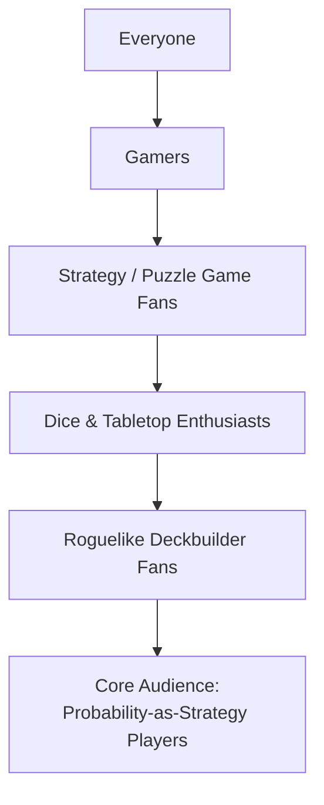

# Marketing

## Short Description

> A dice-crafting roguelike where you collect, customize, and roll dice to score combos against escalating odds. Shape your luck — every face you swap changes the game.

*(178 characters)*

## Audience Funnel

### Funnel Breakdown

| Layer | Who they are | What hooks them |
|-------|-------------|-----------------|
| Everyone | General public | Dice are universally familiar — no learning barrier to understand "roll dice, get score" |
| Gamers | People who play video games regularly | Polished digital experience with satisfying feedback loops, available on PC |
| Strategy / Puzzle fans | Players who enjoy thinking over reflexes | Tactical depth in hold/reroll decisions; no time pressure, pure decision-making |
| Dice & Tabletop enthusiasts | Yahtzee, Dice Forge, board game players | Physical dice nostalgia in digital form; face-swapping mechanic echoes Dice Forge |
| Roguelike deckbuilder fans | Balatro, Slay the Spire, Slice & Dice players | Run-based progression, build-crafting, escalating stakes, "one more run" pull |
| **Core audience** | Players who love bending probability | Dice customization as probability engineering; the game *rewards* understanding odds, not just chasing luck |
