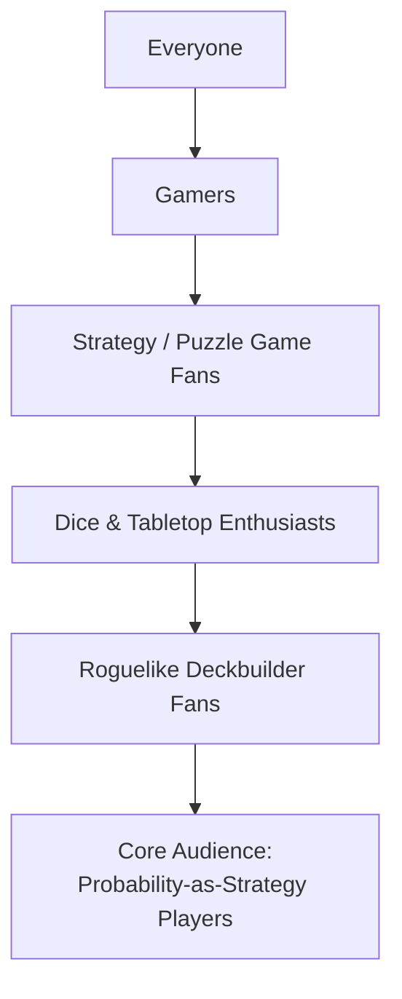

# Marketing

## Short Description

> A dice-crafting roguelike where you collect, customize, and roll dice to score combos against escalating odds. Shape your luck — every face you swap changes the game.

*(178 characters)*

## Audience Funnel

### Funnel Breakdown

| Layer | Who they are | What hooks them |
|-------|-------------|-----------------|
| Everyone | General public | Dice are universally familiar — no learning barrier to understand "roll dice, get score" |
| Gamers | People who play video games regularly | Polished digital experience with satisfying feedback loops, available on PC |
| Strategy / Puzzle fans | Players who enjoy thinking over reflexes | Tactical depth in hold/reroll decisions; no time pressure, pure decision-making |
| Dice & Tabletop enthusiasts | Yahtzee, Dice Forge, board game players | Physical dice nostalgia in digital form; face-swapping mechanic echoes Dice Forge |
| Roguelike deckbuilder fans | Balatro, Slay the Spire, Slice & Dice players | Run-based progression, build-crafting, escalating stakes, "one more run" pull |
| **Core audience** | Players who love bending probability | Dice customization as probability engineering; the game *rewards* understanding odds, not just chasing luck |

## Marketing Beats Plan

The marketing plan is built around weekly public beats.

Each week has one main event that gives players a reason to wishlist Probabimals on Steam.

| Week | Main event | What we publish / do | Where |
| --- | --- | --- | --- |
| 1 | Trailer release | Publish the main trailer with the clearest "Balatro x Yahtzee" hook and the Steam link in every post. | Steam, YouTube, TikTok, Discord |
| 2 | Demo release | Publish the playable demo and announce it everywhere, framing the demo as the easiest way to try the game before wishlisting. | Steam, browser demo link, TikTok, Discord |
| 3 | Developer stream | Run a live developer stream showing the flea market, face swapping, rerolls, and combo payoffs, then cut clips from the stream. | YouTube or Twitch, then TikTok and Discord |
| 4 | Steam Early Access launch | Launch the game in Steam Early Access and announce the release with store assets, gameplay clips, and a direct wishlist-to-play funnel. | Steam, Discord, TikTok |
| 5 | Festival participation | Join an online festival or demo showcase and announce the event as a limited-time chance to discover the game early. | Steam, festival page, Discord, TikTok |
| 6 | Influencer / YouTuber video | Amplify a creator video or first-look playthrough of Probabimals and repost the strongest clips and reactions. | YouTube, Discord, TikTok, Steam news |
| 7 | Community challenge event | Launch a small challenge around highest score, favorite combo, or best die build and repost the best community entries. | Discord, TikTok, Steam post |
| 8 | Release date announcement | Publish the release date with the strongest gameplay footage, headline hook, and a final wishlist push. | Steam, YouTube, TikTok, Discord |
